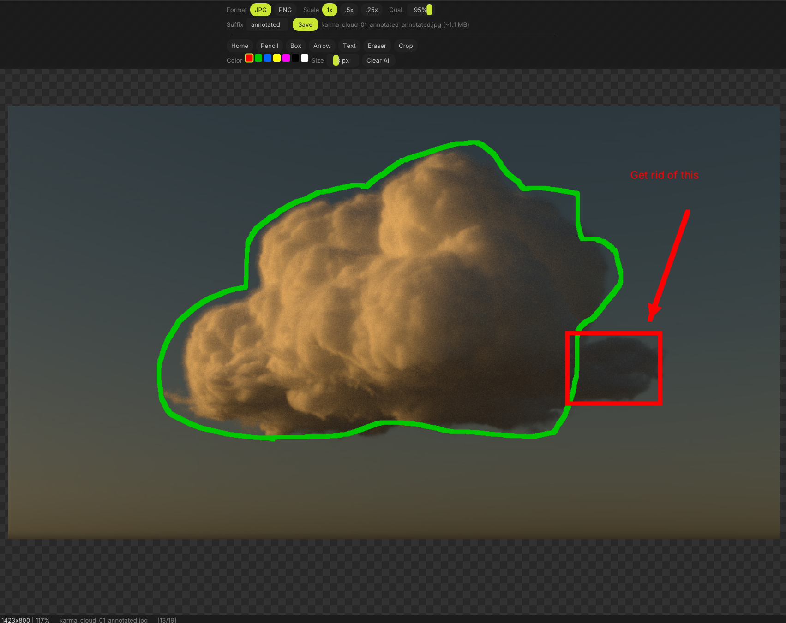

# Peek

A lightweight image viewer and annotator writtend fir speed.  Humbly offered as a default image viewer for Windows. Built as a single self-contained executable with no external dependencies.

  

## Features

- **Fast image loading** — opens common formats instantly (PNG, JPEG, BMP, GIF, TGA, HDR, PSD, EXR)
- **Annotation tools** — pencil, box, arrow, text, and crop overlay drawn non-destructively on top of the image
- **Zoom & pan** — scroll wheel to zoom, middle-click drag to pan
- **Folder browsing** — arrow keys or UI to step through images in the same directory
- **Drag & drop** — drop an image file onto the window to open it
- **Save with options** — export as PNG or JPEG with configurable quality, scale, and filename suffix
- **File association** — register as the default viewer for image types from within the app
- **Single exe** — static CRT linkage, no installer needed

## Screenshot



## Building

### Requirements

- Windows 10/11
- [Visual Studio 2022 Build Tools](https://visualstudio.microsoft.com/downloads/#build-tools-for-visual-studio-2022) (C++ workload)
- [CMake 3.20+](https://cmake.org/download/)

### Build

```powershell
powershell -ExecutionPolicy Bypass -File build.ps1
```

The output executable is `build/Peek.exe`.

## Controls

| Input | Action |
|---|---|
| Scroll wheel | Zoom in/out |
| Middle-click drag | Pan |
| Left/Right arrow | Previous/next image in folder |
| Ctrl+S | Quick save with current settings |
| Drag & drop | Open image file |

## Annotation Tools

Draw, box, arrow, and text tools with a palette of 7 colors (red, green, blue, yellow, magenta, black, white). Annotations are composited over the original image — the source file is never modified. Use "Clear All" to remove annotations and return to the original.

## Save Options

- **Format**: PNG or JPEG toggle
- **JPEG quality**: 40%–100% slider (default 95%)
- **Scale**: 1x, 0.5x, 0.25x
- **Filename suffix**: appended before the extension (default: "annotated")
- Subsequent saves of the same image auto-increment with `_a`, `_b`, `_c`, etc.

## Tech Stack

- C++20
- [Dear ImGui](https://github.com/ocornut/imgui) (docking branch) — UI
- DirectX 11 — rendering
- [stb](https://github.com/nothings/stb) — image loading/writing
- [tinyfiledialogs](https://sourceforge.net/projects/tinyfiledialogs/) — native file dialogs
- [tinyexr](https://github.com/syoyo/tinyexr) — EXR support
- Inter font (embedded)

## License

MIT
